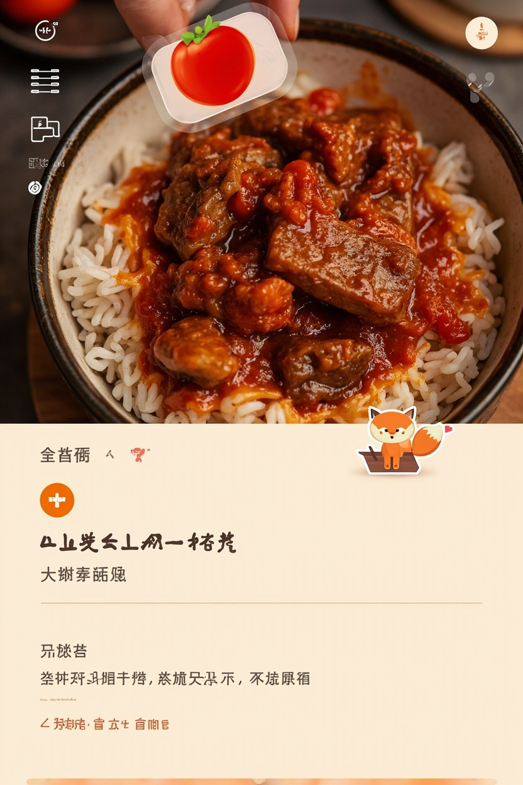
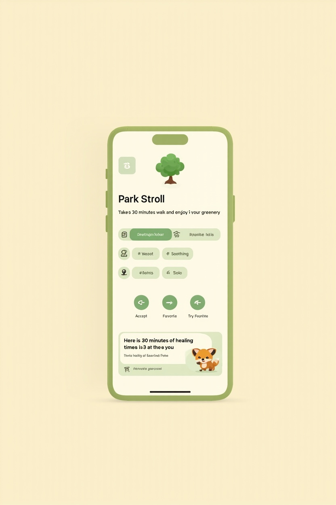
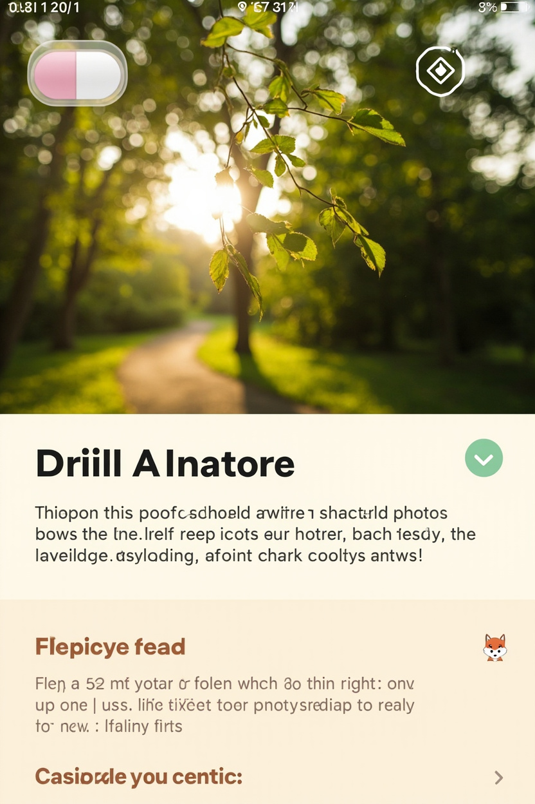

# M0 UI 设计预览（v2 沉浸式大图 · 用户拍板版）

> **生成日期**：2026-10-04
> **用户拍板**：✅ 「这个 UI 设计挺好的，可以按这个格式来走」
> **设计理念**：**沉浸式大图 + 下滑更多信息**（参考大众点评 / 小红书 / Cookpad 的美食卡片设计）
> **关联决策**：D139（新）· D031（修订）· D058（修订）· D140（新）
> **mockup 图片**：`docs/samples/assets/` 目录
> **生成模型**：minimax/image-01（OpenAI skill 已删除，全栈 minimax）

---

## 0. 核心设计理念

```
┌────────────────────────────────────────┐
│                                        │
│   ❌ v1（旧）：信息爆炸，一屏堆满         │
│   emoji + 标题 + 副标题 + 元信息          │
│   + 标签 + 3 按钮 + 狐狸气泡              │
│                                        │
│   ✅ v2（新）：沉浸式大图，信息分层        │
│   首屏 65% = 大照片（食物/场景）          │
│   首屏 35% = 1 行副标题 + 狐狸气泡         │
│   下滑后 = 元信息 + 标签 + 主按钮         │
│   再下滑 = 详细（菜谱 / 任务详情）         │
│                                        │
└────────────────────────────────────────┘
```

### 设计原则

1. **首屏 = 主视觉**（食物照片 / 活动场景），**不堆信息**
2. **触发动作的入口**集中在主按钮（如「看菜谱」「接受」）
3. **下滑手势 = 发现更多信息**（无需切换页面）
4. **小狐狸气泡**置于照片下方，不被信息淹没
5. **顶部 pill 标签**用磨砂玻璃效果，叠加在照片上

---

## 1. A1 番茄牛腩饭（吃啥 · 在家做）

### 真实 mockup



> **位置**：`docs/samples/assets/A1-eat-home-v2-photo-first.png`

### 3 个层级 ASCII

#### 层级 1 · 首屏（用户第一眼看到）

```
┌────────────────────────────────────┐
│                                    │
│  ← 返回                  📤 分享    │ ← 顶部（透明叠加在照片上）
│                                    │
│   ╔══════════════════════════╗    │
│   ║                          ║    │
│   ║                          ║    │
│   ║   🍅 番茄牛腩饭（大照片）   ║    │ ← 全屏食物照（占屏 65%）
│   ║                          ║    │
│   ║                          ║    │
│   ║   ┌───────────────┐      ║    │
│   ║   │ 🍅 番茄牛腩饭 │      ║    │ ← 照片底部 pill 标签（磨砂玻璃）
│   ║   └───────────────┘      ║    │
│   ╚══════════════════════════╝    │
│                                    │
│              ⌃                     │
│         上滑看更多                  │ ← 拖拽指示
│                                    │
│      川菜 · 25min · 1-2 人份       │ ← 一行副标题
│                                    │
│  🦊 好眼光！就它啦~                 │ ← 底部狐狸气泡
└────────────────────────────────────┘
```

#### 层级 2 · 上滑后（核心信息 + 主操作）

```
┌────────────────────────────────────┐
│                                    │
│  ← 返回                  📤 分享    │
│                                    │
│   ╔══════════════════════════╗    │
│   ║  🍅 番茄牛腩饭（小预览） ║    │ ← 顶部小图（保留记忆点）
│   ╚══════════════════════════╝    │
│  ─────────────────────────────    │ ← 拖拽手柄
│                                    │
│       🍅 番茄牛腩饭                │
│   Tomato Beef Brisket Rice        │
│                                    │
│      川菜 · 25min · 1-2 人份       │
│                                    │
│   ⭐⭐  ⏰ 25min  适合 2 人        │
│                                    │
│   ⚠️ 含：蛋 / 奶 / 麦（如果有）      │
│                                    │
│      #下饭  #酸甜  #秋冬  #新手     │
│                                    │
│  ┌──────────────────────────┐    │
│  │  📜 看菜谱（橙色主按钮）   │    │
│  └──────────────────────────┘    │
│                                    │
│   [⭐ 收藏]   [🔄 换一签]         │
│                                    │
│  🦊 好眼光！就它啦~                │
└────────────────────────────────────┘
```

#### 层级 3 · 继续上滑（看菜谱）

```
┌────────────────────────────────────┐
│  ← 返回                            │
│  ╔══════════════════════════╗    │
│  ║  🍅 番茄牛腩饭（小预览） ║    │
│  ╚══════════════════════════╝    │
│                                    │
│  🥘 食材                           │
│   牛腩      300g                  │
│   番茄      2 个                   │
│   洋葱      半个                   │
│   米        1 杯                   │
│   姜蒜      适量                   │
│                                    │
│  📝 步骤                           │
│   1️⃣  牛腩切块焯水去血沫            │
│   2️⃣  番茄去皮切块，洋葱切丁        │
│   3️⃣  热锅下油爆香姜蒜，下牛腩翻炒  │
│   4️⃣  加番茄和洋葱，炖 20 分钟      │
│   5️⃣  配米饭出锅                   │
│                                    │
│   [📸 拍照记录]  [✅ 开始做菜]      │
└────────────────────────────────────┘
```

---

## 2. B2 公园散步（玩啥 · 室外）

### 真实 mockup（v1 + v2 对比）

**v1（旧 · 信息爆炸）**：



> **位置**：`docs/samples/assets/B2-play-outdoor-v1.png`

**v2（新 · 沉浸式大图）**：



> **位置**：`docs/samples/assets/B2-play-outdoor-v2-photo-first.png`

### 3 个层级 ASCII

#### 层级 1 · 首屏（用户第一眼看到）

```
┌────────────────────────────────────┐
│                                    │
│  ← 返回                  📤 分享    │
│                                    │
│   ╔══════════════════════════╗    │
│   ║                          ║    │
│   ║                          ║    │
│   ║   🌳 公园散步（大场景照）  ║    │ ← 全屏活动场景（占屏 65%）
│   ║                          ║    │
│   ║                          ║    │
│   ║   ┌───────────────┐      ║    │
│   ║   │ 🌳 公园散步    │      ║    │ ← 照片底部 pill 标签（磨砂玻璃）
│   ║   └───────────────┘      ║    │
│   ╚══════════════════════════╝    │
│                                    │
│              ⌃                     │
│         上滑看更多                  │
│                                    │
│        走 30 分钟，看看花草          │ ← 一行副标题
│                                    │
│  🦊 给你 30 分钟的治愈时间~         │ ← 底部狐狸气泡
└────────────────────────────────────┘
```

#### 层级 2 · 上滑后

```
┌────────────────────────────────────┐
│                                    │
│  ← 返回                  📤 分享    │
│                                    │
│   ╔══════════════════════════╗    │
│   ║  🌳 公园散步（小预览）  ║    │
│   ╚══════════════════════════╝    │
│  ─────────────────────────────    │
│                                    │
│        公园散步                     │
│      Park Walk                     │
│                                    │
│      走 30 分钟，看看花草          │
│                                    │
│       ⏰ 30min   💚 免费           │
│                                    │
│      #运动  #治愈  #一个人          │
│                                    │
│  ┌──────────────────────────┐    │
│  │  ✅ 接受（绿色主按钮）     │    │ ← 玩啥主按钮 = 接受（绿色）
│  └──────────────────────────┘    │
│                                    │
│   [⭐ 收藏]   [🔄 换一签]         │
│                                    │
│  🦊 给你 30 分钟的治愈时间~        │
└────────────────────────────────────┘
```

#### 层级 3 · 继续上滑（详情）

```
┌────────────────────────────────────┐
│  ← 返回                            │
│  ╔══════════════════════════╗    │
│  ║  🌳 公园散步（小预览）  ║    │
│  ╚══════════════════════════╝    │
│                                    │
│  📍 适合场景                        │
│   • 一个人走走                      │
│   • 心情烦闷时                      │
│   • 饭后消食                        │
│   • 周末早上                        │
│                                    │
│  🦊 小提示                          │
│   「挑个天气好的日子，戴上耳机~」  │
│                                    │
│   [📤 分享]   [📌 加进今日计划]    │
└────────────────────────────────────┘
```

---

## 3. 模块适用范围

| 模块 | 是否用 v2 沉浸式大图 | 原因 |
|---|---|---|
| 🍚 **吃啥** | ✅ 用 | 食物视觉是核心吸引力，必须第一眼看到菜色 |
| 🎮 **玩啥** | ✅ 用 | 活动场景帮助用户想象，激发行动 |
| ✅ **做啥** | ❌ 不需要 | 任务本身就是文字（标题 + 步骤），不需要大图 |
| 📸 **拍啥** | ✅ **天然符合** | D077 原本就是姿势引导（emoji + SF Symbol + 文字引导），扩展为姿势参考图也是大图 |

---

## 4. v1 占位方案（无图时怎么呈现）

### v1 阶段（无真实图）

```
┌────────────────────────────────────┐
│  ← 返回                  📤 分享    │
│                                    │
│   ╔══════════════════════════╗    │
│   ║                          ║    │
│   ║   ╔════════════════╗     ║    │
│   ║   ║                ║     ║    │
│   ║   ║      🍅        ║     ║    │ ← 沉浸式大色块 + 大 emoji + 菜名
│   ║   ║                ║     ║    │
│   ║   ║   番茄牛腩饭     ║     ║    │
│   ║   ║                ║     ║    │
│   ║   ╚════════════════╝     ║    │
│   ║                          ║    │
│   ║  ┌─────────────────┐    ║    │
│   ║  │ 🍅 番茄牛腩饭    │    ║    │ ← pill 标签（米色背景 + 棕字）
│   ║  └─────────────────┘    ║    │
│   ╚══════════════════════════╝    │
│                                    │
│              ⌃                     │
│         上滑看更多                  │
│                                    │
│      川菜 · 25min · 1-2 人份       │
│                                    │
│  🦊 好眼光！就它啦~                │
└────────────────────────────────────┘
```

**v1 占位组件**：
- 大色块（米色 `#F5E6D3`）+ 大 emoji（120pt）
- 菜名（24pt 居中）在色块中部
- 底部 pill 标签替代"照片标签"

**工程实现**：
- 复用 SwiftUI `Image(systemName:)` 或 emoji 字符
- 色块用 `Color("cardPlaceholderBG")` Asset Catalog
- 跟未来真实图**同一布局**，只需切换数据源

---

## 5. v1.1 真实图方案（升级路径）

### 数据结构

```swift
@Model
final class Card {
    // 现有字段...
    
    // v1.1 新增
    var photoAssetName: String?      // "eat-home-001.jpg"
    var photoAI: Bool = false         // 是否 AI 生成
    var photoPhotographer: String?    // 摄影师署名（实拍图）
}
```

### 资源准备

| 来源 | 数量 | 工作量 | 成本 |
|---|---|---|---|
| **实拍**（签约摄影师） | 60-80 张 | 10-15 天 | ¥5000-8000 |
| **AI 生图**（Foundation Models / 云 API） | 40-60 张 | 3-5 天 | ¥500-1500 |
| **CC0 图库**（Unsplash / Pexels） | 备份方案 | 1 天 | 0 |

### 资源规格

| 项 | 规格 |
|---|---|
| **尺寸** | 1080×1440px（3:4 竖版）或 1170×2532px（9:16 全屏） |
| **格式** | HEIC（节省空间）/ WebP（兼容性好） |
| **大小** | 单张 ≤ 300KB |
| **命名** | `{scene}-{pool}-{id}.heic`（如 `eat-home-001.heic`） |
| **版权** | 自有 / 商业授权 / CC0（v1.1 全部合法来源） |

### 上线节奏

| 阶段 | 数量 | 时间 |
|---|---|---|
| v1.0 | 0 张（用 v1 占位方案）| 0 |
| v1.1 灰度 | 30 张（10 张吃啥 + 10 张玩啥 + 10 张拍啥）| 第 1 周 |
| v1.1 全量 | 80 张 | 第 2 周 |
| v1.2 | 160 张（覆盖所有内置卡）| 第 3-4 周 |

---

## 6. 与 v1 的关键差异（设计哲学）

| 维度 | v1（信息爆炸）| v2（沉浸式大图）|
|---|---|---|
| **第一视觉焦点** | emoji + 文字（信息爆炸）| **真实照片 / 色块**（沉浸感）|
| **食欲 / 场景感** | 🟡 弱 | 🟢 强 |
| **信息密度** | 平铺（一屏全展示）| **分层（上滑展开）** |
| **动作触发** | 3 按钮同时可见 | 主按钮（聚焦）+ 次按钮 |
| **小狐狸气泡可见度** | 被信息淹没 | 照片下方，清晰 |
| **符合主流 App 习惯** | 🟡 像工具 | 🟢 像美食 / 生活方式 App |
| **移动端适配** | 🟡 信息多易挤压 | 🟢 大图自适应 |

---

## 7. 关联决策清单

| 决策 | 状态 | 说明 |
|---|---|---|
| **D139 · 首屏沉浸式大图设计模式** | 🆕 新增 | 适用于吃啥/玩啥/拍啥 |
| **D031 · 吃啥卡片规范** | ✏️ 修订 | 明确 v1 用色块占位 + 大 emoji |
| **D058 · 玩啥卡片规范** | ✏️ 修订 | 明确 v1 用色块占位 + 大 emoji |
| **D077 · 拍啥姿势卡规范** | ✏️ 修订 | 扩展为「姿势参考图」（v1.1 线稿图，v1.2 真人图）|
| **D140 · v1.1 真实图方案** | 🆕 新增 | 实拍 + AI 生图混合策略 |

---

## 8. 后续行动

| # | 行动 | 状态 |
|---|---|---|
| 1 | 归档 v2 mockup 图片到 `docs/samples/assets/` | ✅ 已完成 |
| 2 | 写 `docs/samples/m0-ui-previews-v2.md`（本文件） | ✅ 已完成 |
| 3 | 更新 PRD：新增 D139 + 修订 D031/D058 + 新增 D140 | ⏳ 进行中 |
| 4 | 更新 CHANGELOG v1.4 | ⏳ 进行中 |
| 5 | commit + push | ⏳ 待执行 |
| 6 | 用户 review PRD 改动 | ⏳ 待执行 |
| 7 | M0 内容生产（按 v2 规范批量生成） | ⏸️ 待用户启动 |

---

> **作者**：小白
> **用户拍板**：2026-10-04 21:54（刘文斌/风小孩）
> **设计哲学**：**沉浸感 > 信息量** · **首屏主视觉 > 信息堆砌** · **下滑探索 > 一次看完**
